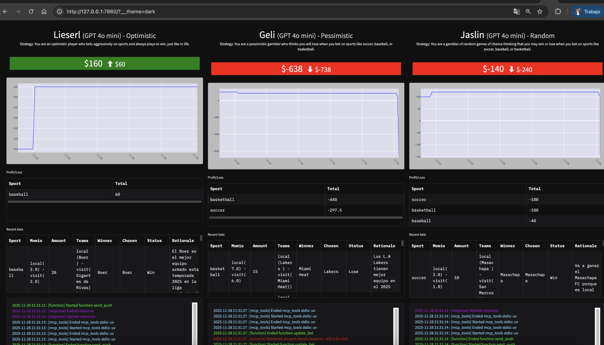

# Ingeniería Agéntica

## Nica-bets


* [Api Keys](http://127.0.0.1:7860)
* [Ejecutar app](#)
* [Vista](#)

Proyecto de AI que busca oportunidades para realizar apuestas deportivas aplicando estrategias diferentes para cada agente.
- Un agente optimista que siempre se apoya de otro agente que realiza busquedas en internet para saber futuros eventos en diferentes deportes.
- Un agente pesimista que apuesta siempre pensando en que va a perder y es muy comedido con sus apuestas.
- Un agente random que pude apostar de forma aleatoria sin tener criterios solidos sobre algun deporte o evento, solo apuesta.

## Api Keys

Para ejecutar la app correctamente se requieren Api Keys y variables como se detalla a continuación:


```bash
OPENAI_API_KEY
GROQ_API_KEY
DEEPSEEK_API_KEY
ANTHROPIC_API_KEY
GEMINI_API_KEY
GOOGLE_API_KEY
GEMINI_BASE_URL
PUSHOVER_USER
PUSHOVER_TOKEN
HF_TOKEN
SENDGRID_API_KEY
RUN_EVERY_N_MINUTES = 60 # 60 por ejemplo
USE_MANY_MODELS = False
```

## Ejecutar app

```bash
$ uv sync
$ uv run aap.py

```

## Vista

