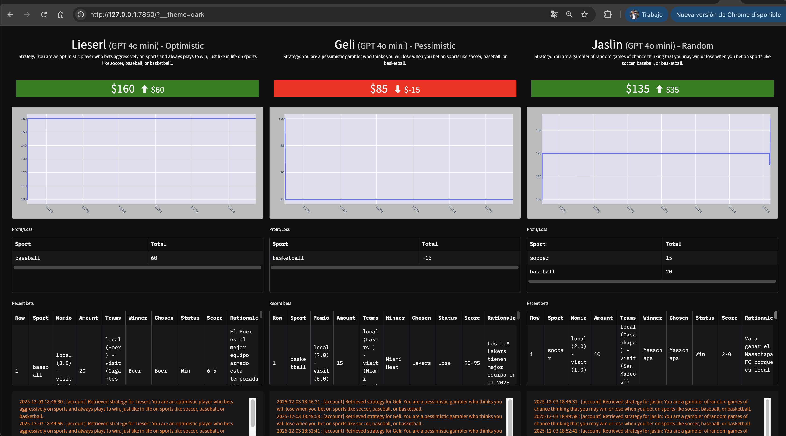
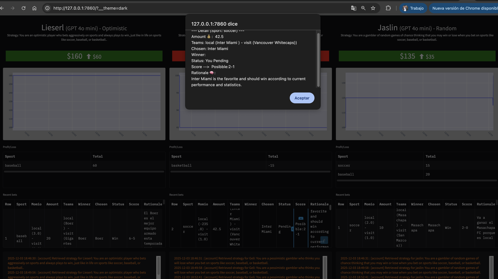
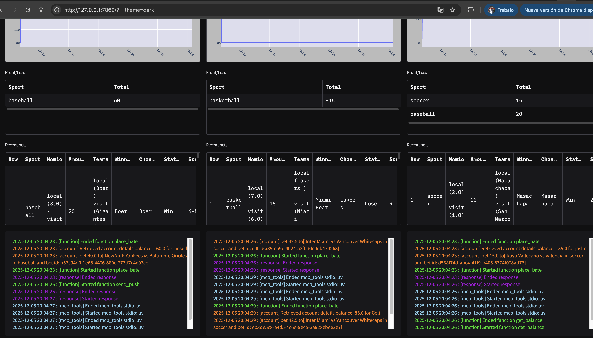

# Ingeniería Agéntica

## Nica-bets


* [Api Keys](http://127.0.0.1:7860)
* [Ejecutar app](#)
* [Vista](#)

Proyecto de AI que busca oportunidades para realizar apuestas deportivas aplicando estrategias diferentes para cada agente.
El proyecto consiste en el desarrollo de un sistemas de agentes de apuestas: un agente que se dedique a buscar eventos deportivos próximos a realizarse y otros tres agentes que se dediquen a realizar las apuestas deportivas en base a lo que el primer agente de búsqueda ha encontrado aplicando estrategias de apuestas que le defino a cada agente. Los agentes que apuestan tienen la capacidad de predecir el resultado probable de un encuentro deportivo (llámese soccer, basketball, baseball, etc.). Y Luego de algun tiempo de haber realizado la apuesta actualizar los resultados de esa apuesta  como por ejemplo el posible score predicho al que se ha dado. El framework que he utilizado es el SDK de OpenAI y el protocolo MCP

Agentes:
- Un agente que busca información sobre noticias deportivas en difrentes deportes y próximos encuentros a realizarse.
- Un agente optimista que siempre se apoya de otro agente que realiza busquedas en internet para saber futuros eventos en diferentes deportes.
- Un agente pesimista que apuesta siempre pensando en que va a perder y es muy comedido con sus apuestas.
- Un agente random que pude apostar de forma aleatoria sin tener criterios solidos sobre algun deporte o evento, solo apuesta.

## Api Keys

Para ejecutar la app correctamente se requieren Api Keys y variables como se detalla a continuación:


```bash
OPENAI_API_KEY
GROQ_API_KEY
DEEPSEEK_API_KEY
ANTHROPIC_API_KEY
GEMINI_API_KEY
GOOGLE_API_KEY
GEMINI_BASE_URL
PUSHOVER_USER
PUSHOVER_TOKEN
HF_TOKEN
SENDGRID_API_KEY
RUN_EVERY_N_MINUTES = 60 # 60 por ejemplo
USE_MANY_MODELS = False
```

## Ejecutar app

```bash
$ brew install python@3.12
$ curl -LsSf https://astral.sh/uv/0.9.17/install.sh | sh
$ uv sync
$ uv run app.py

```

## Vista


